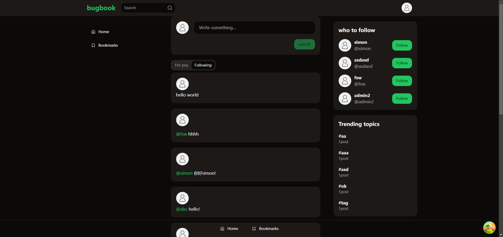
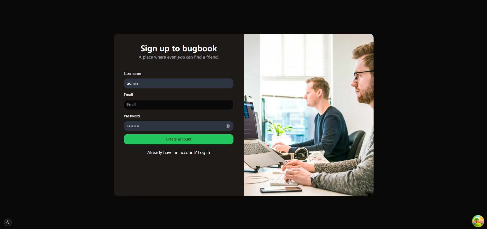
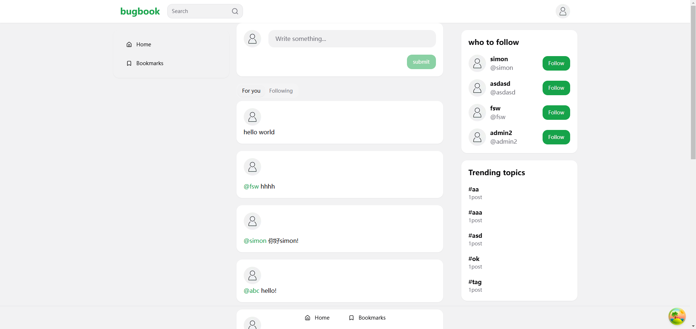
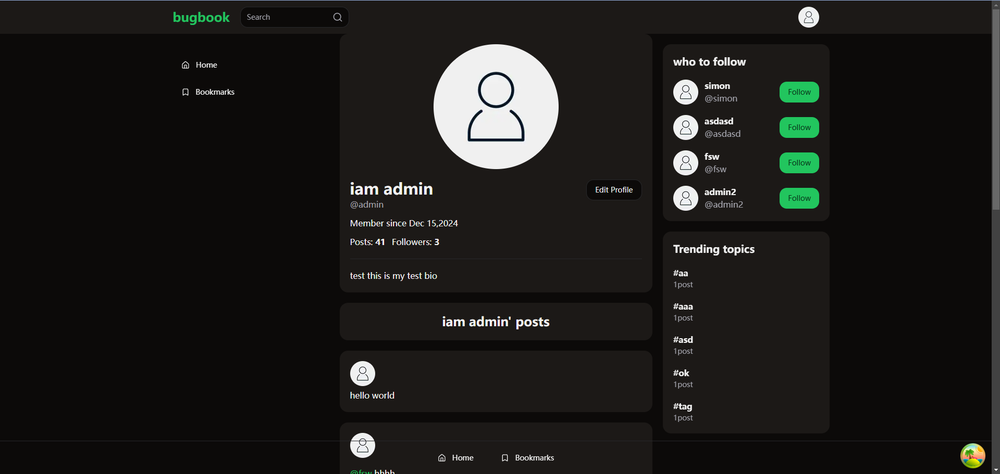
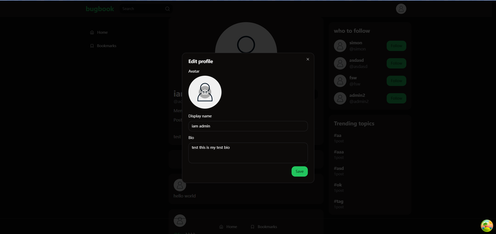

# bugbook

### 技术栈：react  nextjs  react-query react-hook-form zod lucia-auth tailwindcss

### 实现功能： 

1. 登录，退出，注册
2. 修改个人信息
3. 关注对象
4. 乐观更新关注对象时 对应的按钮样式改变
5. 加载骨架屏
6. 显示推荐帖子
7. 显示关注对象帖子
8. 趋势话题
9. 切换深色模式

登录页：

注册页：

首页：

深色模式界面：

修改信息界面:

修改信息内容界面：
